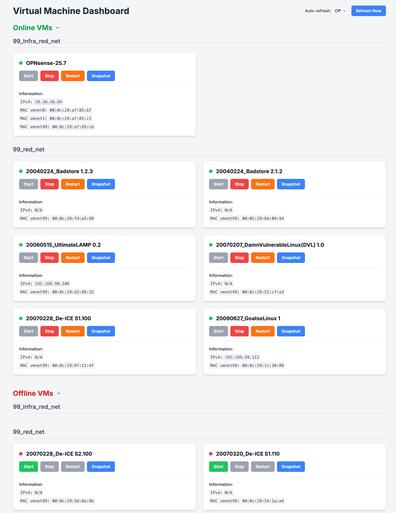

### Simple VM Manager for vmware workstation management in headless  mode


#### Description 
To help me easily manage my lab VMs without remote connection I made this simple manager. 
Its a simple Flask app to expose Start/Stop/Restart VMware workstation management in web browser. 
In addition there is simple button to snapshot vm and save it to disk under name of current date and time.

#### Metadata
If possible and guest tools are available it will show primary IP of VM. 
After IP it will list all MAC addresses of ethernet devices found in vmx file. 
Sometime additional NIC is not visible in UI and this will tell me that I should be careful. 


#### Setup
<hr>

- Create python3 virtual environment activate it and install requirements
```
python3 -m venv venv
source venv/bin/activate
pip install -r requirements.txt
```

- Run app.py on terminal for start local server
<hr>


#### Example



##### Run it as a service

/etc/systemd/system/ws-manager.service 

```
cat /etc/systemd/system/ws-manager.service
[Unit]
Description=Gunicorn instance to serve my web app
After=network.target


[Service]
User=username
Group=groupname
WorkingDirectory=/home/username/ws-vm_manager
Environment="PATH=/home/username/ws-vm_manager/venv/bin"
Environment="FLASK_DEBUG=1"
ExecStart=/home/username/ws-vm_manager/venv/bin/python3 /home/username/ws-vm_manager/app.py
Restart=always
```